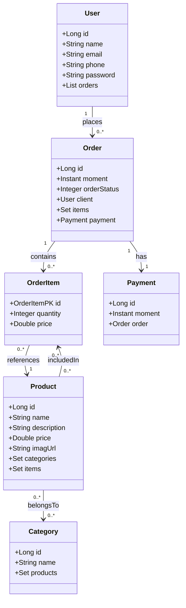

# E-Commerce API

## Descrição

Este projeto é uma API desenvolvida em **Java 17**, com o intuito de servir como base para um sistema de e-commerce. A API permite realizar operações como criação de usuários, produtos, categorias e ordens. O banco de dados utilizado para testes é o **H2**, enquanto para produção utilizamos o **PostgreSQL**. O deployment é feito através da plataforma **Railway**, e a documentação da API está disponível via **Swagger**.

### Funcionalidades:
- **Usuários**: Criação e gerenciamento de usuários, com informações como nome, email, telefone e senha.
- **Produtos**: Criação, atualização e gerenciamento de produtos, incluindo informações como nome, descrição, preço, imagem e categorias associadas.
- **Ordens**: Criação de ordens de compra, com itens e pagamento associado.
- **Categorias**: Criação e gerenciamento de categorias, com a possibilidade de associar produtos a elas.

## Tecnologias

- **Java 17**
- **H2** (banco de dados para testes)
- **PostgreSQL** (banco de dados para produção)
- **Swagger** (documentação da API)
- **Railway** (deploy)

## Endpoints da API

A documentação completa da API está disponível através do Swagger, que pode ser acessado ao iniciar a aplicação.

## Diagrama de Classes

Abaixo, temos o diagrama de classes que representa a estrutura do banco de dados e os relacionamentos entre as entidades.



### Relações entre as classes:

- **Usuário** pode criar **muitas ordens**.
- **Ordem** pode ter **muitos itens de ordem**.
- **Itens de ordem** se referem a um **produto**.
- **Ordem** possui um **pagamento**.
- **Produto** pode pertencer a **muitas categorias**.
- **Produto** pode estar em **muitos itens de ordem**.

## Configuração e Execução

### Pré-requisitos:

- **Java 17** ou superior
- **Maven** (para gerenciar dependências)
- **PostgreSQL** (para ambiente de produção)
- **Railway** (para deploy)
- **H2** (para testes)

### Iniciar o Projeto Localmente:

1. Clone este repositório:
   ```bash
   git clone https://github.com/usuario/e-commerce-api.git
   cd e-commerce-api
   ```

2. Compile e execute o projeto com Maven:
   ```bash
   mvn clean install
   mvn spring-boot:run
   ```

3. Acesse a documentação Swagger na URL: [http://localhost:8080/swagger-ui.html](http://localhost:8080/swagger-ui.html)

## Contribuições

Contribuições são bem-vindas! Sinta-se à vontade para abrir **issues** e enviar **pull requests**.

## Licença

Este projeto está licenciado sob a **MIT License**.

---

